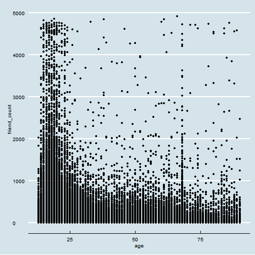
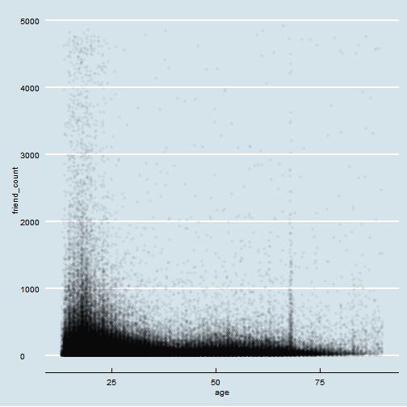
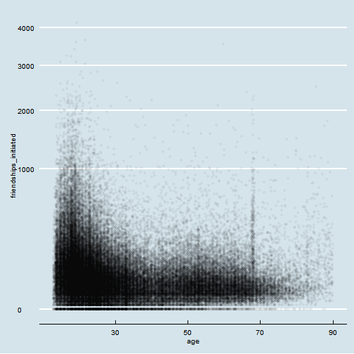
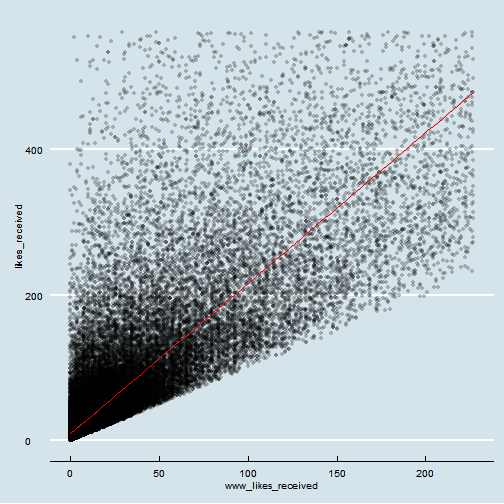
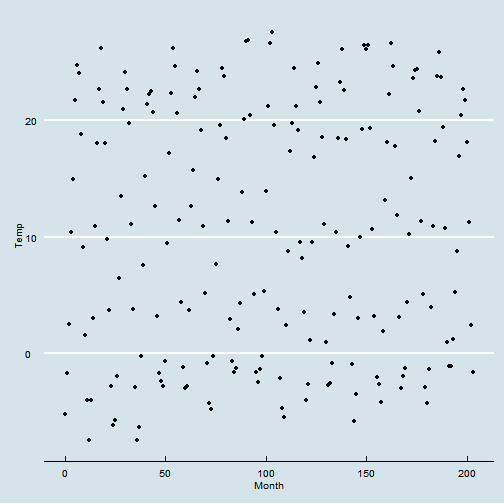
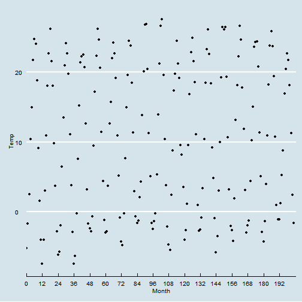

Lesson 4
========================================================
read in data

```
## Warning: New theme missing the following elements: legend.box,
## panel.margin.x, panel.margin.y
```

### Scatterplots and Perceived Audience Size
qplot

```r
qplot(x = age, y = friend_count, data = pf)
```

 

equalvent ggplot

```r
ggplot(aes(x = age, y = friend_count), data = pf) + 
  geom_point()
```

 

limit the x axis

```r
ggplot(aes(x = age, y = friend_count), data = pf) + 
  geom_point() +
  xlim(13,90)
```

```
## Warning: Removed 4906 rows containing missing values (geom_point).
```

 

add transparent and jitter to look through the overlapping points
### Overplotting

```r
ggplot(aes(x = age, y = friend_count), data = pf) + 
  geom_jitter(alpha = 1/20) +
  xlim(13,90)
```

```
## Warning: Removed 5184 rows containing missing values (geom_point).
```

 

#### What do you notice in the plot?
Response: most young user have friends less than 1000, not significantly bigger than older user.

### Coord_trans()

```r
ggplot(aes(x = age, y = friend_count), data = pf) + 
  geom_point(alpha = 1/20, position = position_jitter(h = 0)) +
  xlim(13,90) +
  coord_trans(y = "sqrt")
```

```
## Warning: Removed 5174 rows containing missing values (geom_point).
```

-1.png) 


```r
ggplot(aes(x = age, y = friendships_initiated), data = pf) + 
  geom_point(alpha = 1/20, position = position_jitter(h=0))+
  xlim(13,90) + 
  coord_trans(y = "sqrt")
```

```
## Warning: Removed 5185 rows containing missing values (geom_point).
```

 

### Conditional Means


```r
#install.packages('dplyr')
library(dplyr)
```

```
## Error in library(dplyr): there is no package called 'dplyr'
```

```r
age_groups <- group_by(pf, age)
```

```
## Error in eval(expr, envir, enclos): 没有"group_by"这个函数
```

```r
pf.fc_by_age <- summarise(age_groups, 
          friend_count_mean = mean(friend_count),
          friend_count_median = median(friend_count),
          n = n())
```

```
## Error in eval(expr, envir, enclos): 没有"summarise"这个函数
```

```r
pf.fc_by_age <- arrange(pf.fc_by_age,age)
```

```
## Error in eval(expr, envir, enclos): 没有"arrange"这个函数
```

equal to

```r
pf.fc_by_age <- pf %.%
  group_by(age) %.%
  summarise(friend_count_mean = mean(friend_count),
            friend_count_median = median(friend_count),
            n = n()) %.%
  arrange(age)
```

```
## Error in eval(expr, envir, enclos): 没有"%.%"这个函数
```

```r
pf.fc_by_age
```

```
## Error in eval(expr, envir, enclos): 找不到对象'pf.fc_by_age'
```

# Plot mean friend count vs. age using a line graph.
# Be sure you use the correct variable names
# and the correct data frame. You should be working
# with the new data frame created from the dplyr
# functions. The data frame is called 'pf.fc_by_age'.

# Use geom_line() rather than geom_point to create
# the plot. You can look up the documentation for
# geom_line() to see what it does.

Create your plot!


```r
ggplot(aes(x = age, y = friend_count_mean), data = pf.fc_by_age)+
  geom_line()
```

```
## Error in ggplot(aes(x = age, y = friend_count_mean), data = pf.fc_by_age): 找不到对象'pf.fc_by_age'
```

### Overlaying Summaries with Raw Data

```r
ggplot(aes(x = age, y = friend_count), data = pf) + 
  geom_point(alpha = 1/20,
             position = position_jitter(h = 0),
             color = "orange") +
  xlim(13,90) +
  coord_trans(y = "sqrt") +
  geom_line(stat = "summary", fun.y = mean) +
  geom_line(stat = "summary", fun.y = quantile, probs = .1,
            linetype = 2, color = 'blue') + 
  geom_line(stat = "summary", fun.y = quantile, probs = .9,
            linetype = 2, color = 'red') +
  geom_line(stat = "summary", fun.y = quantile, probs = .5,
            linetype = 2, color = 'green')
```

```
## Warning: Removed 4906 rows containing missing values (stat_summary).
```

```
## Warning: Removed 4906 rows containing missing values (stat_summary).
```

```
## Warning: Removed 4906 rows containing missing values (stat_summary).
```

```
## Warning: Removed 4906 rows containing missing values (stat_summary).
```

```
## Warning: Removed 5187 rows containing missing values (geom_point).
```

 

Better plot

```r
ggplot(aes(x = age, y = friend_count), data = pf) + 
  geom_point(alpha = 1/20,
             position = position_jitter(h = 0),
             color = "orange") +
  coord_cartesian(xlim = c(13,70), ylim = c(0,1000)) +
  geom_line(stat = "summary", fun.y = mean) +
  geom_line(stat = "summary", fun.y = quantile, probs = .1,
            linetype = 2, color = 'blue') + 
  geom_line(stat = "summary", fun.y = quantile, probs = .9,
            linetype = 2, color = 'red') +
  geom_line(stat = "summary", fun.y = quantile, probs = .5,
            linetype = 2, color = 'green')
```

 

### Correlation

```r
names(cor.test(pf$friend_count, pf$age))
```

```
## [1] "statistic"   "parameter"   "p.value"     "estimate"    "null.value" 
## [6] "alternative" "method"      "data.name"   "conf.int"
```

```r
round(cor.test(pf$friend_count, pf$age, meathod = "pearson")$estimate,3)
```

```
##    cor 
## -0.027
```

equal

```r
with(pf, cor.test(age, friend_count,method = "pearson"))
```

```
## 
## 	Pearson's product-moment correlation
## 
## data:  age and friend_count
## t = -8.6268, df = 99001, p-value < 2.2e-16
## alternative hypothesis: true correlation is not equal to 0
## 95 percent confidence interval:
##  -0.03363072 -0.02118189
## sample estimates:
##         cor 
## -0.02740737
```

### Correlation on Subsets

```r
with(subset(pf, pf$age <= 70) , cor.test(age, friend_count))
```

```
## 
## 	Pearson's product-moment correlation
## 
## data:  age and friend_count
## t = -52.5923, df = 91029, p-value < 2.2e-16
## alternative hypothesis: true correlation is not equal to 0
## 95 percent confidence interval:
##  -0.1780220 -0.1654129
## sample estimates:
##        cor 
## -0.1717245
```

### Correlation Methods

```r
with(subset(pf, pf$age <= 70), cor.test(age, friend_count,method = "spearman"))
```

```
## Warning in cor.test.default(age, friend_count, method = "spearman"):
## Cannot compute exact p-value with ties
```

```
## 
## 	Spearman's rank correlation rho
## 
## data:  age and friend_count
## S = 1.5782e+14, p-value < 2.2e-16
## alternative hypothesis: true rho is not equal to 0
## sample estimates:
##        rho 
## -0.2552934
```

## Create Scatterplots
# Create a scatterplot of likes_received (y)
# vs. www_likes_received (x). Use any of the
# techniques that you've learned so far to
# modify the plot.

```r
ggplot(aes(x = www_likes_received,  y = likes_received), data = pf) +
  geom_point()
```

 

### Strong Correlations

```r
ggplot(aes(x = www_likes_received,  y = likes_received), data = pf) +
  geom_point(alpha = 1/4) +
  xlim(0, quantile(pf$www_likes_received, 0.95)) +
  ylim(0, quantile(pf$likes_received, 0.95))+
  geom_smooth(method = "lm", color = 'red')
```

```
## Warning: Removed 6075 rows containing missing values (stat_smooth).
```

```
## Warning: Removed 6075 rows containing missing values (geom_point).
```

 

What's the correlation betwen the two variables? Include the top 5% of values for the variable in the calculation and round to 3 decimal places.


```r
round(with(pf, cor.test(www_likes_received, likes_received))$estimate,3)
```

```
##   cor 
## 0.948
```

### More Caution with Correlation

```r
#install.packages('alr3')
library(alr3)
```

```
## Loading required package: car
```

```r
data(Mitchell)
```


```r
ggplot(aes(x = Month, y = Temp), data = Mitchell) +
  geom_point()
```

 

### Noisy Scatterplots
a. Take a guess for the correlation coefficient for the scatterplot.

0

b. What is the actual correlation of the two variables?
(Round to the thousandths place)


```r
cor(Mitchell$Month, Mitchell$Temp)
```

```
## [1] 0.05747063
```

### Making Sense of Data

```r
ggplot(aes(x = Month, y = Temp), data = Mitchell) +
  geom_point()+
  scale_x_discrete(breaks = seq(0,203,12))
```

 

### A New Perspective

```r
ggplot(aes(x = Month, y = Temp), data = Mitchell) +
  geom_point()+
  scale_x_discrete(breaks = seq(0,203,12))
```

 

### Understanding Noise: Age to Age Months

```r
ggplot(aes(x = age, y = friend_count_mean), data = pf.fc_by_age) +
  geom_line()
```

```
## Error in ggplot(aes(x = age, y = friend_count_mean), data = pf.fc_by_age): 找不到对象'pf.fc_by_age'
```

```r
head(pf.fc_by_age)
```

```
## Error in head(pf.fc_by_age): 找不到对象'pf.fc_by_age'
```

```r
pf.fc_by_age[17:19,]
```

```
## Error in eval(expr, envir, enclos): 找不到对象'pf.fc_by_age'
```

### Age with Months Means


```r
pf$age_with_months <- pf$age + (12 - pf$dob_month) / 12
```

Programming Assignment

```r
age_with_months_groups <- group_by(pf, age_with_months)
```

```
## Error in eval(expr, envir, enclos): 没有"group_by"这个函数
```

```r
pf.fc_by_age_months <- summarise(age_with_months_groups,
                                 friend_count_mean = mean(friend_count),
                                 friend_count_median = median(friend_count),
                                 n = n())
```

```
## Error in eval(expr, envir, enclos): 没有"summarise"这个函数
```

```r
arrange(pf.fc_by_age_months, age_with_months)
```

```
## Error in eval(expr, envir, enclos): 没有"arrange"这个函数
```

### Noise in Conditional Means


```r
ggplot(aes(x = age_with_months, y = friend_count_mean), 
       data = subset(pf.fc_by_age_months, pf.fc_by_age_months$age_with_months <= 71)) +
  geom_line()
```

```
## Error in subset(pf.fc_by_age_months, pf.fc_by_age_months$age_with_months <= : 找不到对象'pf.fc_by_age_months'
```

### Smoothing Conditional Means

```r
q1 <- ggplot(aes(x = age, y = friend_count_mean), 
            data = subset(pf.fc_by_age, pf.fc_by_age$age <= 71)) +
              geom_line() +
  geom_smooth()
```

```
## Error in subset(pf.fc_by_age, pf.fc_by_age$age <= 71): 找不到对象'pf.fc_by_age'
```

```r
q2 <- ggplot(aes(x = age_with_months, y = friend_count_mean), 
       data = subset(pf.fc_by_age_months, pf.fc_by_age_months$age_with_months <= 71)) +
  geom_line() + 
  geom_smooth()
```

```
## Error in subset(pf.fc_by_age_months, pf.fc_by_age_months$age_with_months <= : 找不到对象'pf.fc_by_age_months'
```

```r
q3 <- ggplot(aes(x = round(age/5)*5, y = friend_count),
             data = subset(pf, pf$age <= 71)) +
  geom_line(stat = 'summary', fun.y = mean)

library(gridExtra)
```

```
## Loading required package: grid
```

```r
grid.arrange(q1,q2,q3,ncol = 1)
```

```
## Error in arrangeGrob(..., as.table = as.table, clip = clip, main = main, : 找不到对象'q1'
```

Click **KnitHTML** to see all of your hard work and to have an html
page of this lesson, your answers, and your notes!

